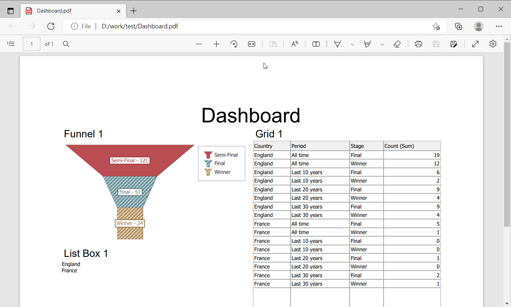

<!-- default badges list -->
[](https://supportcenter.devexpress.com/ticket/details/T1038672)
[](https://docs.devexpress.com/GeneralInformation/403183)
<!-- default badges end -->
# BI Dashboard - Non-Visual Custom Export

This example shows how to use the [DashboardExporter](https://docs.devexpress.com/Dashboard/DevExpress.DashboardCommon.DashboardExporter) component in a console application to export a dashboard with a [custom](https://docs.devexpress.com/Dashboard/403031/winforms-dashboard/winforms-designer/create-a-custom-item) Funnel item.

## How to Use the Application

In the console, run the `DashboardExporterApp.exe` application and specify the path where you want to export the document:

```
D:\work\test\app>DashboardExporterApp.exe D:/work/test
```

The application generates a PDF file from the `Dashboard.xml` dashboard and places it in the _Dashboards_ folder next to the application.



## Example Overview

The following files are used in this example:

### FunnelItemExportControlProvider

**View file**: [CS](./CS/DashboardExporterApp/ExportControlProviders/FunnelItemExportControlProvider.cs)/[VB](./VB/DashboardExporterApp/ExportControlProviders/FunnelItemExportControlProvider.vb)

The `FunnelItemExportControlProvider` class implements the [ICustomExportControlProvider](https://docs.devexpress.com/Dashboard/DevExpress.DashboardCommon.ICustomExportControlProvider) interface. The `FunnelItemExportControlProvider` is used to configure the printable control for the custom Funnel item in the dashboard. 

The [ICustomExportControlProvider.GetPrintableControl](https://docs.devexpress.com/Dashboard/DevExpress.DashboardCommon.ICustomExportControlProvider.GetPrintableControl(DevExpress.DashboardCommon.CustomItemData-DevExpress.DashboardCommon.CustomItemExportInfo)) method specifies the printable `XRChart` control that is used to export the custom Funnel. The method gets [CustomItemExportInfo](https://docs.devexpress.com/Dashboard/DevExpress.DashboardCommon.CustomItemExportInfo) and [CustomItemData](https://docs.devexpress.com/Dashboard/DevExpress.DashboardCommon.CustomItemData) objects as parameters. 

The `CustomItemExportInfo` object contains the custom Funnel's export settings as the [ExportMode](https://docs.devexpress.com/Dashboard/DevExpress.DashboardCommon.CustomItemExportInfo.ExportMode) and master filter state.

The `ChartControl.SelectionMode` property is updated according to the actual master filter mode.
The [SetSelection](https://docs.devexpress.com/Dashboard/DevExpress.DashboardWin.CustomControlProviderBase.SetSelection(DevExpress.DashboardCommon.CustomItemSelection)) method updates the custom control according to the current master filter selection. 

The `ConigureSeries` method is used to bind the custom Funnel chart's series to data and configure them. The [CustomItemData.GetBindings](https://docs.devexpress.com/Dashboard/DevExpress.DashboardCommon.CustomItemData.GetBindings(System.String)) method gets a `CustomItemBindingValue` collection. Each object in this collection contains information about data items stored in a custom item. The object’s `UniqueId` property value can be used as a data member when a custom control is bounded to data. 

### Program

**View file**: [CS](./CS/DashboardExporterApp/Program.cs)/[VB](./VB/DashboardExporterApp/Program.vb)

The [CustomItemExportControlCreating](https://docs.devexpress.com/Dashboard/DevExpress.DashboardCommon.DashboardExporter.CustomItemExportControlCreating) event fires for the Funnel item. The `FunnelItemExportControlProvider` object is assigned to and the [ExportControlProvider](https://docs.devexpress.com/Dashboard/DevExpress.DashboardCommon.CustomItemExportControlCreatingEventArgs.ExportControlProvider) property. The property is used to specify the printable control that corresponds to the exported custom Funnel item.

The [DashboardExporter.ExportToPdf](https://docs.devexpress.com/Dashboard/DevExpress.DashboardCommon.DashboardExporter.ExportDashboardItemToPdf(Dashboard--String--String--Nullable-Size---DashboardState--DashboardPdfExportOptions)) method exports a dashboard as a PDF file.

## Files to Review

* [FunnelItemExportControlProvider.cs](./CS/DashboardExporterApp/ExportControlProviders/FunnelItemExportControlProvider.cs) (VB: [FunnelItemExportControlProvider.vb](./VB/DashboardExporterApp/ExportControlProviders/FunnelItemExportControlProvider.vb))
* [Program.cs](./CS/DashboardExporterApp/Program.cs) (VB: [Program.vb](./VB/DashboardExporterApp/Program.vb))

## Documentation

- [Create an Interactive Data-Aware Item for the WinForms Dashboard](https://docs.devexpress.com/Dashboard/403032/winforms-dashboard/winforms-designer/ui-elements-and-customization/create-a-custom-item/create-an-interactive-data-aware-item)
- [ICustomExportControlProvider](https://docs.devexpress.com/Dashboard/DevExpress.DashboardCommon.ICustomExportControlProvider)
- [DashboardExporter](https://docs.devexpress.com/Dashboard/DevExpress.DashboardCommon.DashboardExporter)
- [CustomItemExportControlCreating](https://docs.devexpress.com/Dashboard/DevExpress.DashboardCommon.DashboardExporter.CustomItemExportControlCreating)

## More examples 

- [BI Dashboard - Non-Visual Export Component](https://github.com/DevExpress-Examples/bi-dashboard-non-visual-exporter)
- [BI Dashboard - How to Email a Dashboard that Displays Different Data Depending on the Addressee](https://github.com/DevExpress-Examples/bi-dashboard-mailkit-export-console-app)
- [BI Dashboard - How to Use MailKit to Send a Dashboard as a Document in PDF](https://github.com/DevExpress-Examples/bi-dashboard-mailkit-export)
